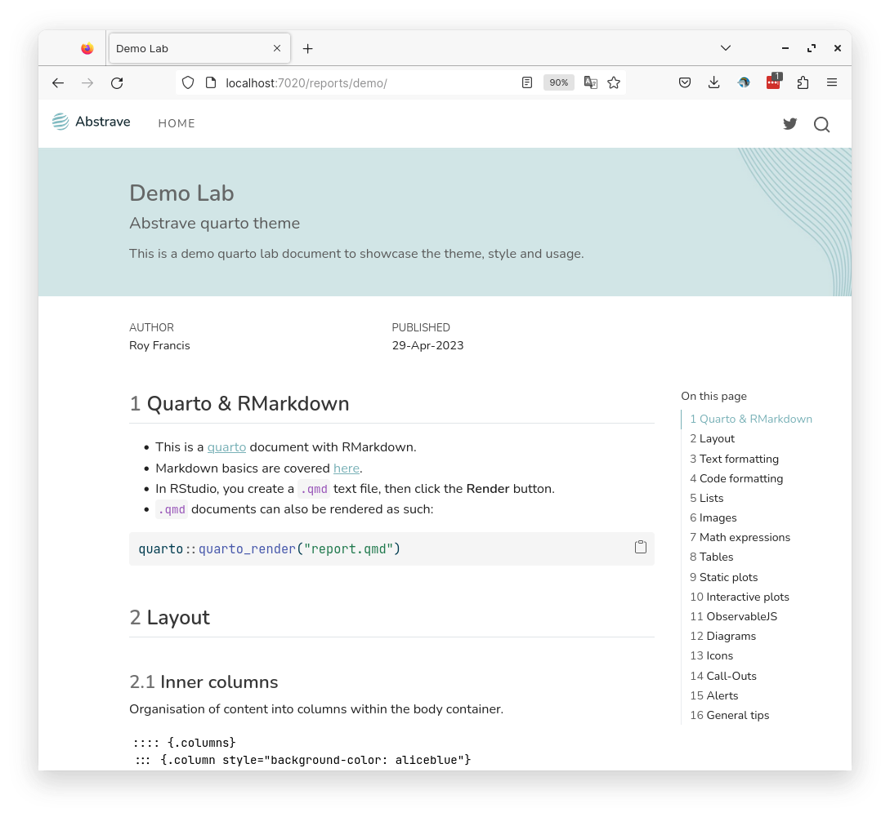
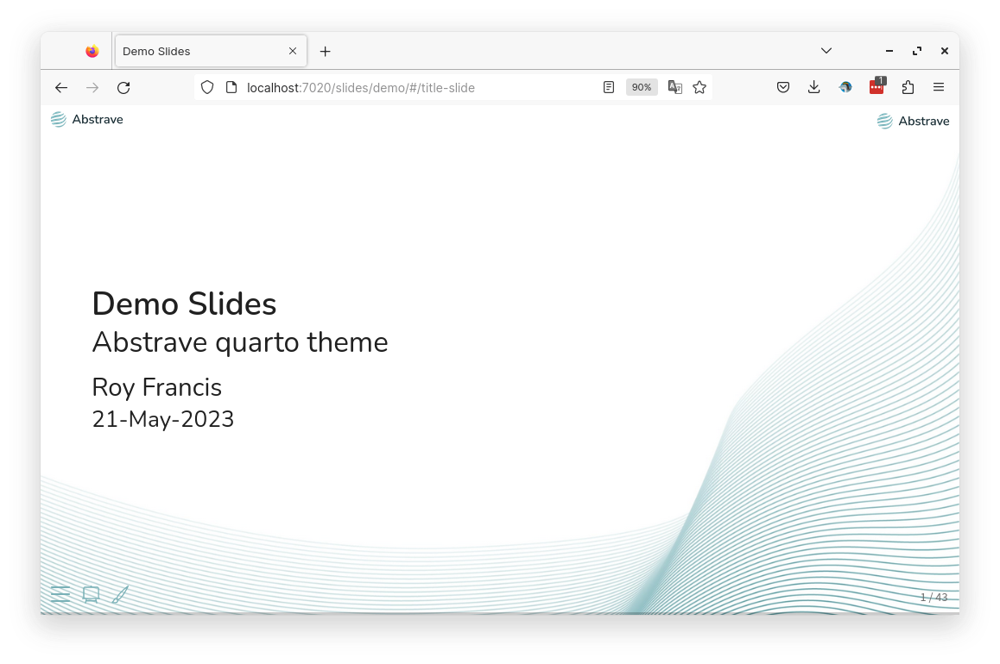

# abstrave <span><a href="https://github.com/royfrancis/abstrave"></a></span> 

Quarto website template.





For a demo site, see [here](https://royfrancis.github.io/abstrave).

## Usage

- Required quarto 1.2.2 or higher
- Run in the terminal

```
quarto use template royfrancis/abstrave
```

- Launch preview in the browser

```
quarto preview
```

- Render all html files into `docs` directory

```
quarto render
```


- Template directory structure

```
.
├── 404.md
├── assets/
├── _extensions
├── index.qmd
├── LICENSE
├── _quarto.yml
├── README.md
├── reports/
└── slides/
```

- Use `##` as the highest level heading.

## Acknowledgements

- Built using [Quarto](https://quarto.org/)
- Uses the [lightbox extension](https://github.com/quarto-ext/lightbox) for viewing images
- Uses the [fontawesome extension](https://github.com/quarto-ext/fontawesome) for icons

---

2023 • Roy Francis
