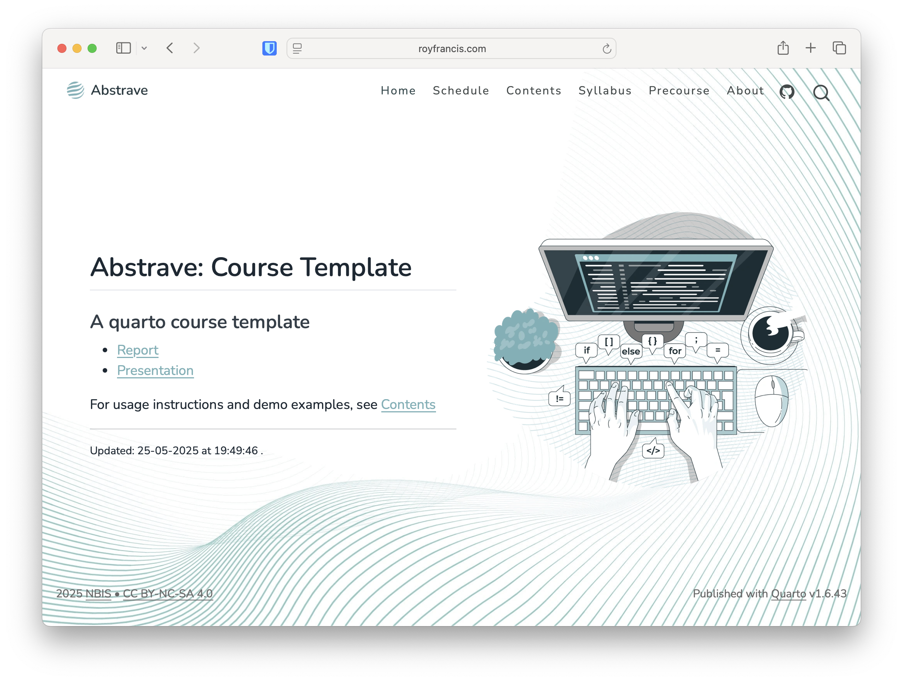
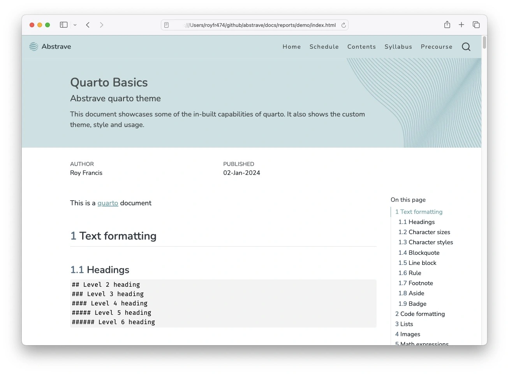
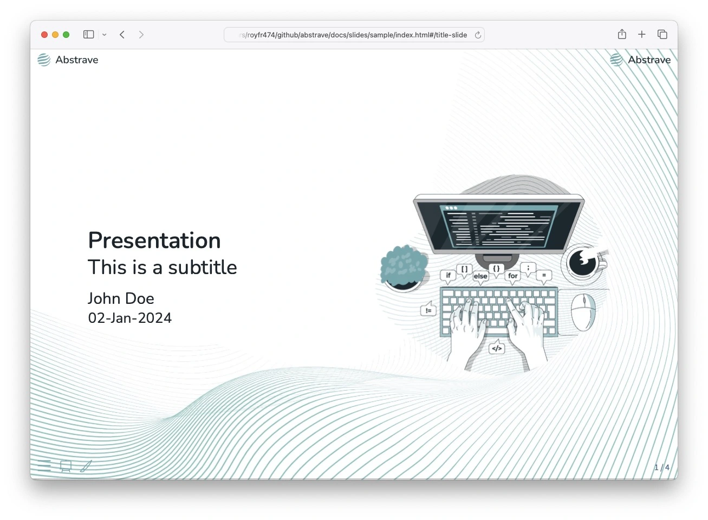

# abstrave <span><a href="https://github.com/royfrancis/abstrave"></a></span> 

[](https://github.com/royfrancis/abstrave/actions?workflow=deploy)  [](https://github.com/royfrancis/abstrave/actions?workflow=linkcheck)  [](https://lifecycle.r-lib.org/articles/stages.html#experimental)

Quarto website template for courses







For a demo site and usage, see [here](https://royfrancis.github.io/abstrave).

## Usage

- Recommended quarto 1.6.43 or higher
- To download and use a starter template, run in the terminal

:exclamation: Demo files are not downloaded

```
quarto use template royfrancis/abstrave
```

- Install required extensions

```
quarto add --no-prompt quarto-ext/fontawesome
quarto add --no-prompt royfrancis/quarto-reveal-logo
quarto add --no-prompt mcanouil/quarto-collapse-output@1.4.0
quarto add --no-prompt royfrancis/quarto-accordion
quarto add --no-prompt royfrancis/quarto-leaflet
```

- Render all html files into `docs` directory to make sure everything works as expected

```
quarto render
```

- See more documentation on the [demo site](https://royfrancis.github.io/abstrave/home_contents.html) for customization

## Showcase

Here is an example of this template in action:

- [RaukR 2025](https://nbisweden.github.io/raukr-2025/)

## Acknowledgements

- Built using [Quarto](https://quarto.org/)
- Uses the [fontawesome extension](https://github.com/quarto-ext/fontawesome) for icons
- Uses the [collapse-output extension](mcanouil/quarto-collapse-output@1.4.0) for code output folding

---

2026 • Roy Francis
